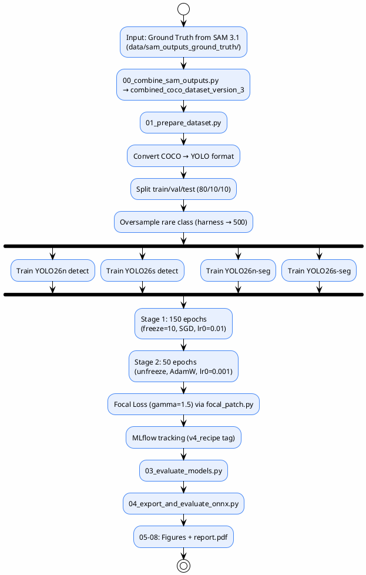
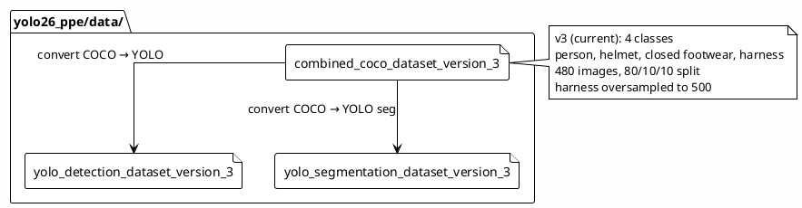

# YOLO26 Training (Requirement 2)

> Train 4 YOLO26 models to compare the accuracy–efficiency trade-off for PPE detection
>
> **Status**: Verified — checked against `yolo26_ppe/`, `yolo26_ppe/reports/final/report.pdf`, `yolo26_ppe/configs/`

---

## Objective

Compare the performance and computational efficiency of 4 YOLO26 models (production-trained) with 2 additional medium models defined for future expansion:

| Model | Task | Scale | Production Weights |
|-------|------|-------|--------------------|
| YOLO26n | Detection | Nano | ✅ Trained |
| YOLO26s | Detection | Small | ✅ Trained |
| YOLO26n-seg | Segmentation | Nano | ✅ Trained |
| YOLO26s-seg | Segmentation | Small | ✅ Trained |
| YOLO26m | Detection | Medium | ❌ Defined only (no trained weights) |
| YOLO26m-seg | Segmentation | Medium | ❌ Defined only (no trained weights) |

> Source: `pipeline_cli.py:97-164`, `yolo26_ppe/scripts/pipeline/02_train_models.py:94-137`, `yolo26_ppe/models/production/` directory listing

---

## Training Pipeline

> **v4_recipe**: All 4 production models use 2-stage training (Stage 1: freeze backbone + high LR, Stage 2: unfreeze + low LR + reduced augmentation). This applies to BOTH detection and segmentation models.

---

## Training Configuration (v4_recipe)

> Source: `yolo26_ppe/scripts/pipeline/02_train_models.py:139-199`, `yolo26_ppe/configs/production_train.yaml`

### Stage 1 — Initial Training (frozen backbone)

| Parameter | Value |
|-----------|-------|
| Epochs | 150 |
| Freeze | 10 (backbone frozen) |
| Optimizer | SGD |
| lr0 | 0.01 |
| lrf | 0.01 (cosine decay) |
| Momentum | 0.937 |
| Weight decay | 0.0005 |
| Warmup epochs | 3 |
| NBS (gradient accumulation) | 32 |
| AMP | true |
| Label smoothing | 0.1 |
| Cos LR | true |
| Seed | 42 |

### Stage 2 — Fine-tuning (unfrozen)

| Parameter | Value |
|-----------|-------|
| Epochs | 50 |
| Freeze | 0 (all layers unfrozen) |
| Optimizer | AdamW |
| lr0 | 0.001 |
| Patience | 15 |
| Augmentation | Reduced (close_mosaic=10, lower mosaic/mixup) |

### Batch Sizes (per model, tuned for 16GB VRAM)

| Model | Batch Size | Note |
|-------|-----------|------|
| nano_detection | 64 | ~8GB VRAM |
| small_detection | 48 | ~15GB VRAM (tight) |
| nano_segmentation | 16 | |
| small_segmentation | 16 | 24 caused deadlock |
| medium_detection | 16 | 32 caused OOM |
| medium_segmentation | 12 | Heavier model |

| Parameter | Value |
|-----------|-------|
| Image size | 640 px |
| Hardware | AMD RX 7800 XT (ROCm, WSL2) |
| Focal Loss | gamma=1.5, alpha=0.25 (via `focal_patch.py` monkey-patch) |
| Random seed | 42 |

---

## Dataset

### Size (v3 — current)

| Split | Ratio | Image count |
|-------|-------|-------------|
| Train | 80% | ~384 |
| Validation | 10% | ~48 |
| Test | 10% | ~48 |
| **Total** | | **480** |

> Source: `yolo26_ppe/scripts/pipeline/01_prepare_dataset.py:37` (SPLIT_RATIOS = 80/10/10), `yolo26_ppe/reports/metrics/comparison_report.md:3` (480 images total)

> **Note**: `comparison_report.md` reports 335/95/50 split (from v2 era). The v3 preparation script uses 80/10/10 ratio.

### Class Distribution (v3 — 4 classes)

| Class | Annotation Count | Status |
|-------|-----------------|--------|
| person | 2267 | Adequate |
| helmet | 2503 | Adequate |
| closed footwear | 3350 | Adequate (merged boots + shoes) |
| harness | 177 | Underrepresented |

> Source: `yolo26_ppe/scripts/pipeline/01_prepare_dataset.py:42-48`

### Class Balancing (v3)

- **Imbalance ratio (before)**: 3350:177 = 19:1 (closed footwear vs harness)
- **Oversampling target**: harness → 500 annotations (from 177, via image duplication, cap 10x per image)
- **Oversampling method**: Duplicate whole images containing rare class instances

> Source: `yolo26_ppe/scripts/pipeline/01_prepare_dataset.py:46-48`

---

## Dataset Versions

> The class scheme evolved through 3 versions. The current production dataset is v3.

| Version | Classes | Key Change |
|---------|--------|------------|
| v1 | 6 (person, helmet, boots, shoes, sandals, harness) | Initial dataset |
| v2 | 5 (merged sandals → shoes) | Improved split + class balancing |
| v3 | 4 (merged boots + shoes → "closed footwear") | Current production — simplifies footwear distinction |

> Source: `yolo26_ppe/data/` directory listing, `yolo26_ppe/scripts/pipeline/01_prepare_dataset.py:11-13`
>
> **Note**: `production_train.yaml` still references v2 data paths (lines 54, 60, 66, 72), but the actual data directory only contains v3 datasets. The training script `02_train_models.py` uses `/tmp/` paths (copied from v3 datasets at runtime).

---

## MLflow Integration

YOLO26 training uses **MLflow** for experiment tracking (unlike SAM 3.1 which uses SQLite):

@import "../../yolo26_ppe/configs/mlflow.yaml" {title="mlflow.yaml"}

> MLflow tracking URI and configuration are in `yolo26_ppe/configs/mlflow.yaml`

---

## Training Config

@import "../../yolo26_ppe/configs/production_train.yaml" {title="production_train.yaml"}

---

## Augmentation Config

@import "../../yolo26_ppe/configs/production_augmentation.yaml" {title="production_augmentation.yaml"}

---

## Hyperparameter Tuning

> **Note**: The tuning results below are from the v2 era (50-epoch trials vs 150-epoch baseline). The current production metrics (v4_recipe) are significantly higher — see `final_eval_results.json`. The tuning trials could not match the full-training baseline, so all baseline weights were retained.

| Model | Baseline mAP50 (v2) | Best Trial mAP50 | Improved? | Final mAP50 (v4_recipe) |
|-------|---------------------|-------------------|-----------|--------------------------|
| n_detect | 0.4623 | 0.3950 | ❌ No | **0.712** |
| s_detect | 0.5551 | 0.4937 | ❌ No | **0.808** |
| n_seg | 0.4158 | 0.3822 | ❌ No | **0.547** |
| s_seg | 0.5538 | 0.4753 | ❌ No | **0.654** |

> **Summary**: 50-epoch tuning trials could not match the 150-epoch baseline — all baseline weights were retained. The v4_recipe 2-stage training (150+50 epochs with Focal Loss + gradient accumulation) significantly improved all models over the v2 baseline.
>
> Source: `yolo26_ppe/reports/metrics/comparison_report.md:119-174` (v2 tuning), `yolo26_ppe/reports/inputs/final_eval_results.json` (v4_recipe final)

### Tuned Parameters

- `lr0`, `imgsz`, `cls_pw`, `mosaic`, `mixup`, `copy_paste`, `scale`, `close_mosaic`

---

## References

- `yolo26_ppe/reports/final/report.pdf` — full report
- `yolo26_ppe/reports/source/report.tex:628-747` — RQ2 chapter
- `yolo26_ppe/reports/inputs/final_eval_results.json` — metrics
- `yolo26_ppe/reports/metrics/comparison_report.md` — comparison summary
- `yolo26_ppe/configs/production_train.yaml` — training config
- `yolo26_ppe/configs/production_augmentation.yaml` — augmentation config
- `yolo26_ppe/configs/mlflow.yaml` — MLflow config
